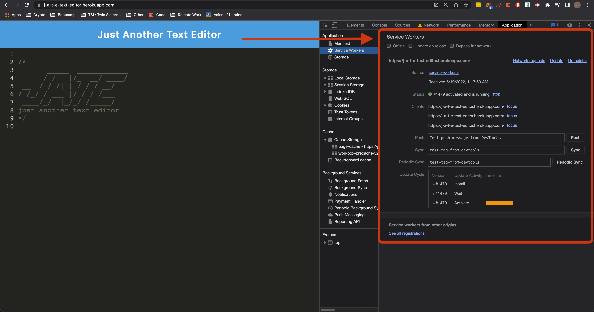
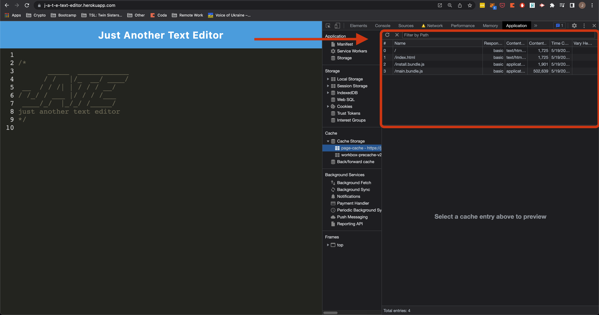
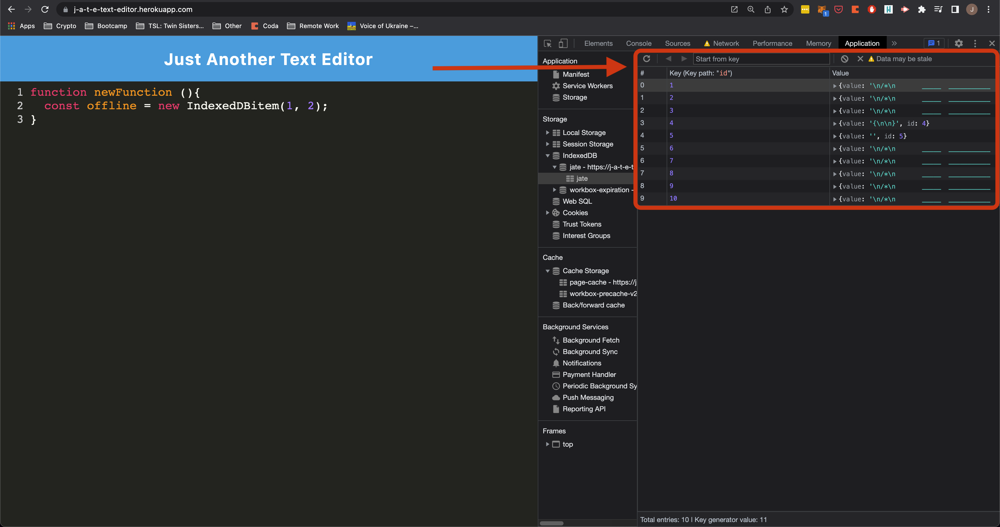

# Just-Another-Text-Editor

## 👉 [This application is live!](https://j-a-t-e-text-editor.herokuapp.com/)

&nbsp;  

---
## Description:

'JATE', or 'Just Another Text Editor', is a Progressive Web Application (PWA) implementation of a JavaScript-friendly editor giving users a simple but powerful code drafting experience. It employs service workers and caching for native offline functionality, and can be installed to the users browser/desktop as a Web Application.

&nbsp;  

---
## Table of Contents:

- [Installation](#installation)
- [Usage](#usage)
- [License](#license)
- [Contributing](#contributing)
- [Tests](#tests)
- [Questions](#questions)

&nbsp;  

---
## Installation:

[This application is deployed and live](https://j-a-t-e-text-editor.herokuapp.com/); however, the code is available here for download and custom deployment. To run the app on your local machine, you must have node installed. Run the command `npm i` on the root directory to install all client- and server-side dependencies, including:
- Babel
- Webpack
- Workbox
- Express 
- Concurrently
- IndexedDB
... and more

In order to deploy the project, you must both build the webpack and launch the server to serve the build. You can do so by running `npm run start` on the root directory, or `npm run start:dev` to feed live updates to your build package. 

Because this project implements webpack, the build process is completely predictable and standardized; changes can be made freely to the `/src` directory with the expectation that the webpack configurations (found in `webpack.config.js`) will ensure organized and high-performance bundling of assets during the build process.

&nbsp;  

---
## Usage:

This app features a custom service worker.

The service worker asynchronously caches assets for offline use. These operations occur independently from the main thread, meaning there is no performance impact while caching. Once the caching is complete, the service worker intercepts requests from the client to the server and services the requests from the cache. Because the service worker operates locally, within the browser, even if the connection with the server is lost the app will continue to function without problems, even upon page refresh.

Data persistence of user input is achieved via a mix of local storage and the [IndexedDB package](https://developer.mozilla.org/en-US/docs/Web/API/IndexedDB_API), which enables NoSQL-type storage organization and optimization within the browser. Every time the user makes a change to their text, the changes are saved to local storage; when the user clicks on anything outside of the text area, the changes are automatically saved to the database.

Taking full advantage of its offline functionality, this PWA can be installed onto a user's browser/homescreen for offline/local use. Notice the presence of the installed PWA in the browsers available apps, the opening of the PWA standalone window, and the continued data persistence of user input.

&nbsp;  

---
---
#### *License:*

&nbsp;  

---
#### *How to Contribute:*

Please see the contact information in the ‘Questions’ section.

&nbsp;  

---

#### *Tests:*

No tests have been deployed at this time.

&nbsp;  

---

#### *Questions?*

[Find me on GitHub: jonathan-warkentine](https://github.com/jonathan-warkentine)

Or send an email: [jonathan.warkentine@gmail.com](mailto:jonathan.warkentine@gmail.com)
